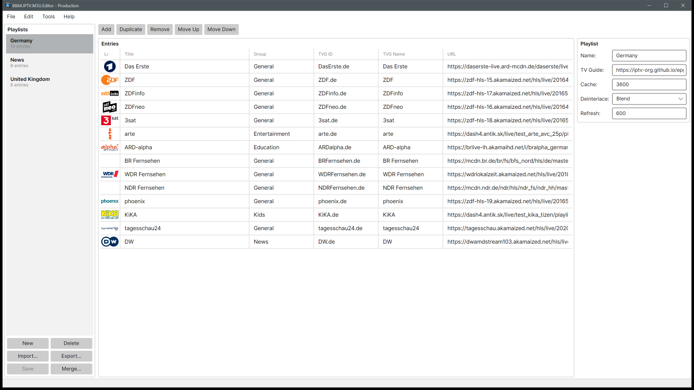
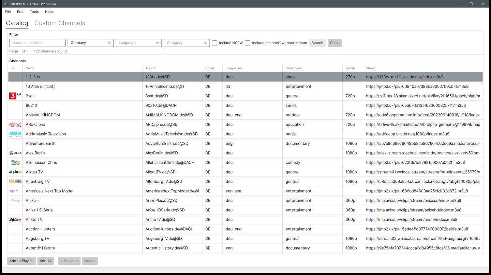
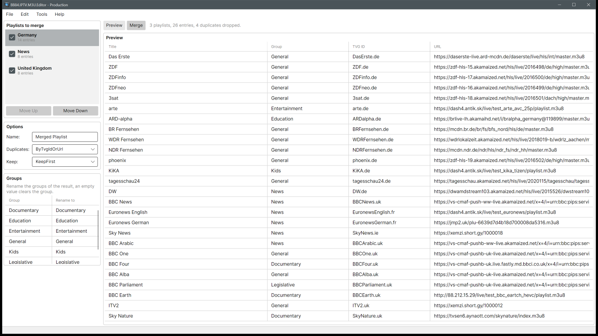
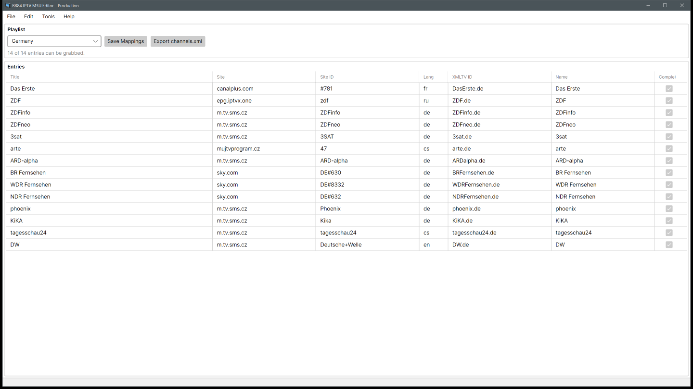
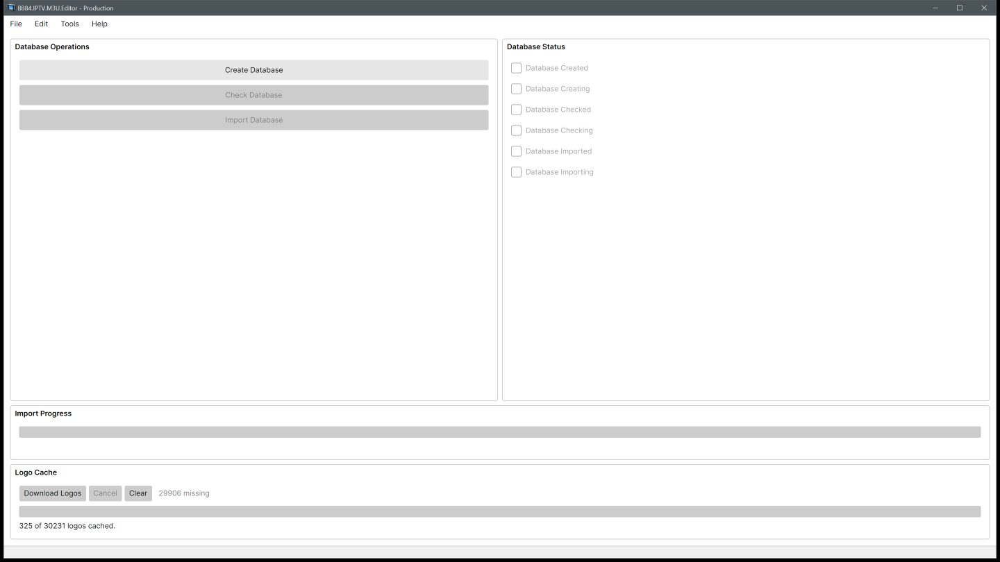
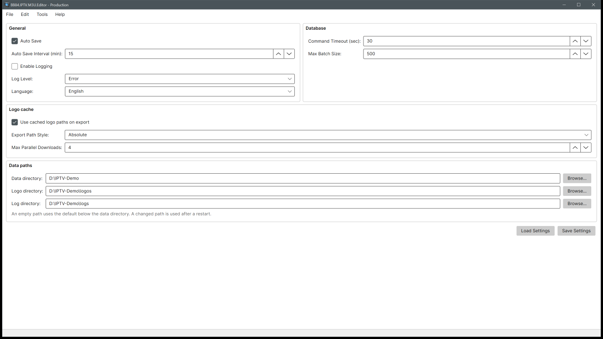

# BB84.IPTV

[](https://github.com/BoBoBaSs84/BB84.IPTV/actions/workflows/build.yml)
[](https://github.com/BoBoBaSs84/BB84.IPTV/actions/workflows/pages/pages-build-deployment)
[](https://github.com/BoBoBaSs84/BB84.IPTV/actions/workflows/github-code-scanning/codeql)
[](https://github.com/BoBoBaSs84/BB84.IPTV/actions/workflows/dependabot/dependabot-updates)

[](https://github.com/BoBoBaSs84/BB84.IPTV)
[](https://github.com/BoBoBaSs84/BB84.IPTV)
[](https://github.com/BoBoBaSs84/BB84.IPTV/issues)
[](https://github.com/BoBoBaSs84/BB84.IPTV/commit/main)
[](https://github.com/BoBoBaSs84/BB84.IPTV)
[](LICENSE)
[](https://github.com/BoBoBaSs84/BB84.IPTV/releases/latest)

A desktop application to view, create, edit and merge IPTV playlists (M3U). Channel data comes from the public [iptv-org API](https://github.com/iptv-org/api), is stored in a local SQLite database and can be combined with your own custom channels. The app can also generate a `channels.xml` for [iptv-org/epg](https://github.com/iptv-org/epg#usage), so that your custom channel list gets matching program guide data.

The application is a cross-platform AvaloniaUI app and runs on Windows, Linux and macOS. SQLite is the single store for catalog data, playlists, custom channels, guide mappings and logo cache metadata.

## Screenshots

|                                                                             |                                                                              |
| --------------------------------------------------------------------------- | ---------------------------------------------------------------------------- |
| <br>Playlist editor        | <br>Channel catalog          |
| <br>Merge playlists               | <br>`channels.xml` mapping |
| <br>Database and logo cache | <br>Settings                 |

## Features

### Playlists

- Create, rename, delete, import and export playlists; they live in the database, M3U is the import and export format.
- Entry grid with add, remove, reorder and inline editing of title, group, `tvg-id`, `tvg-name` and URL, including dirty tracking and validation.
- The M3U serializer keeps unknown `#EXTINF` attributes and directives such as `#EXTVLCOPT`, so an import → database → export round trip loses neither entries nor metadata.
- The playlist header (`url-tvg`, cache, deinterlace, refresh) is preserved.

### Channel catalog and custom channels

- Searchable, filterable catalog over the imported channels with their streams and logos (country, language, category, NSFW flag).
- Catalog channels are added to a playlist one by one or all results at once. An entry keeps the iptv-org `Channel` and `Feed` id, so it stays linked to the catalog.
- Custom channels (name, URL, group, logo, `tvg-id`) cover streams that are not in the catalog. Any URL scheme is allowed, for example `rtsp://192.168.12.1:554` for a stream from somewhere else in your network.
- The "Channels" screen (menu `Tools`) shows the catalog and the custom channels on two tabs. Results are paged, 500 channels per page, and report the total; playlists and custom channels are paged in SQL as well.

### Merging

- Merge two or more playlists in a chosen order into a new playlist; the sources are never modified.
- Options: append, de-duplicate by `tvg-id`, by URL or by either, keep the first or the last of two duplicates, rename or clear groups.
- The result is previewed before it is committed, with the merged entries, the number of dropped duplicates and the groups of the result. The header of the first source is kept, and an entry without a `tvg-id` or URL is never a duplicate.

### Local logo cache

- Channel logos are downloaded to `<app data>/logos/<channel>/<file>`; the local path, the ETag, a content hash, the size and the download time are stored in the database.
- One logo is picked per channel: the one of the feed, then the one without special tags, then the format that displays best, then the larger image.
- Bulk download from the `Logo Cache` section of the Database screen, with progress, Cancel and Clear. Logos are downloaded in batches (four by default, at most 16), a run skips what is already on disk and is therefore resumable, and refreshes with the ETag.
- The catalog list and the playlist editor read the cache only, never the network. SVG renders through `Svg.Controls.Skia.Avalonia`, WebP through Skia, so a playlist displays fully offline.
- An M3U export can write `tvg-logo` as a local path, absolute or relative; the stored playlist keeps its URLs.

### `channels.xml` export

- Output in the format used by iptv-org/epg:

  ```xml
  <?xml version="1.0" encoding="UTF-8"?>
  <channels>
    <channel site="example.com" site_id="123" lang="de" xmltv_id="Das Erste.de">Das Erste</channel>
  </channels>
  ```

- Every playlist entry is mapped to `site`, `site_id`, `lang` and `xmltv_id` (the entry's `tvg-id`). The mapping is prefilled from the imported guide data, every value can be overridden, and custom channels are mapped by hand.

### Database

- The schema is managed by EF Core migrations, applied while the application starts.
- "Create Database" only resets the iptv-org catalog, so playlists, custom channels and guide mappings survive a catalog re-import.
- The import of the iptv-org data reports its progress in the status bar of the main window, like every other long running operation.

### Settings and diagnostics

- Data paths: the directory of the database, of the cached logos and of the log files are configurable, with a folder dialog per path. An empty or not fully qualified value falls back to the per-user data directory, and a changed path asks for a restart. The settings file itself always stays in the default directory, because it is what tells the application where everything else lives.
- Logo policy: whether an export writes the cached file instead of the URL, whether that path is absolute or relative, and how many logos are downloaded at once.
- General: interface language, logging and log level, auto save and its interval. The user interface is localized in English, German, Spanish, French and Italian.
- Errors, warnings and information are reported through one notification path, which shows the message and writes the log entry.

## Data sources

| Source                                                                     | Used for                                                                                                                                   |
| -------------------------------------------------------------------------- | ------------------------------------------------------------------------------------------------------------------------------------------ |
| [`https://iptv-org.github.io/api/*.json`](https://github.com/iptv-org/api) | Channels, feeds, streams, guides, logos, categories, languages, countries. Imported by `WebService` / `DatabaseService`.                   |
| [iptv-org/epg](https://github.com/iptv-org/epg#usage)                      | Format of `channels.xml`.                                                                                                                  |
| `misc/epg-de.xml(.gz)`                                                     | German EPG snapshot, refreshed weekly by `.github/workflows/epg.yml` on the `epg` branch, which opens a pull request. Not part of the app. |

## Architecture

Clean-architecture layering, dependencies point inward:

```
Host (Avalonia)  →  Infrastructure  →  Application  →  Domain
```

- **Domain**: EF entities and playlist models.
- **Application**: interfaces, services, MVVM view models, events, settings, localized resources. View models stay UI-framework-free.
- **Infrastructure**: EF Core / SQLite, iptv-org HTTP client, file, settings and logging services.
- **Host**: UI and the presentation service implementations (`IFileDialogService`, `INotificationService`, `IUserService`).

## Data model

| Entity                            | Purpose                                                        | Key relations                                       |
| --------------------------------- | -------------------------------------------------------------- | --------------------------------------------------- |
| `PlaylistEntity`                  | Playlist header (name, `url-tvg`, cache, refresh, deinterlace) | 1 → n `PlaylistEntryEntity`                         |
| `PlaylistEntryEntity`             | Ordered entry with title, group, `tvg-*` metadata, URL         | iptv-org `Channel`/`Feed` id                        |
| `CustomChannelEntity`             | User-defined channel and stream URL                            | copied into an entry when it is added to a playlist |
| `GuideMappingEntity`              | `site` / `site_id` / `lang` / `xmltv_id` for `channels.xml`    | per entry, prefilled from `GuideEntity`             |
| Logo cache fields on `LogoEntity` | Local path, hash/ETag, downloaded-at                           | 1 → 1 with existing logo row                        |

## Build and run

```bash
dotnet build BB84.IPTV.slnx
dotnet test BB84.IPTV.slnx
dotnet run --project src/BB84.IPTV.M3U.Editor
```

Requires the .NET 10 SDK.

## License

[MIT](LICENSE). See also the [Code of Conduct](CODE_OF_CONDUCT.md).
